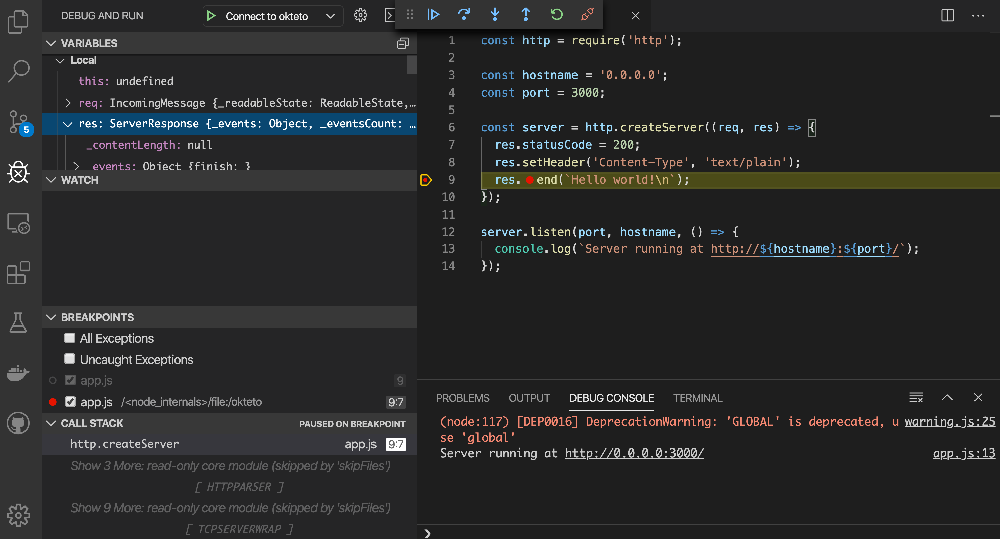

# Develop Node Applications directly in Kubernetes with Okteto

This example shows how to leverage [Okteto](https://github.com/okteto/okteto) to develop a Node Sample App directly in Kubernetes. The Node Sample App is deployed using raw Kubernetes manifests.

Okteto is a client-side only tool that works in any Kubernetes cluster. If you need access to a Kubernetes cluster, [Okteto Cloud](https://cloud.okteto.com) gives you free access to sandboxes Kubernetes namespaces, compatible with any Kubernetes tool.

## Step 1: Deploy the Node Sample App

Get a local version of the Node Sample App by executing the following commands:

```console
$ git clone https://github.com/okteto/node-getting-started
```

The `k8s.yml` file contains the Kubernetes manifests to deploy the Node Sample App. Run the application by executing:

```console
$ kubectl apply -f k8s.yml
```

```console
deployment.apps "hello-world" created
service "hello-world" created
```

This is cool! You typed one command and a dev version of your application just runs 😎. 

## Step 2: Start your development environment in Kubernetes

With the Node Sample App deployed, run the following command:

```console
$ okteto up
 ✓  Development environment activated
 ✓  Files synchronized
    Namespace: cindy
    Name:      hello-world
    Forward:   3000 -> 3000
               2345 -> 2345

okteto>
```

```console
$ okteto up
 ✓  Okteto Environment activated
 ✓  Files synchronized
 ✓  Your Okteto Environment is ready
    Namespace: cindy
    Name:      hello-world
    Forward:   3000 -> 3000
               9229 -> 9229

Welcome to your development environment. Happy coding!
okteto>
```

The `okteto up` command starts a [Kubernetes development environment](https://okteto.com/docs/reference/development-environment/index.html), which means:

- The Node Sample App container is updated with the docker image `okteto/node:10`. This image contains the required dev tools to build, test and run the Node Sample App.
- A [file synchronization service](https://okteto.com/docs/reference/file-synchronization/index.html) is created to keep your changes up-to-date between your local filesystem and your application pods.
- Container ports 3000 (the application) and 9229 (the debugger) are forwarded to localhost.
- A remote shell is started in your Kubernetes development environment. Build, test and run your application as if you were in your local machine.

> All of this (and more) can be customized via the `okteto.yml` [manifest file](https://okteto.com/docs/reference/manifest/index.html).

To run the application in hot-reload mode, execute in the remote shell:

```console
okteto> nodemon app.js
```

```console
[nodemon] 2.0.2
[nodemon] to restart at any time, enter `rs`
[nodemon] watching dir(s): *.*
[nodemon] watching extensions: js,mjs,json
[nodemon] starting `node app.js`
Server running at http://0.0.0.0:3000/
```

Test your application by running the command below in a local shell:

```console
$ curl localhost:3000
```

```console
Hello world!
```

## Step 3: Develop directly in the cloud

Open the `app.js` file in your favorite local IDE and modify the response message on line 9 to be *Hello world from the cluster!*. Save your changes.

```node
  res.end(`Hello world from the cluster!`);
```

Okteto will synchronize your changes to your development environment in Kubernetes. Take a look at the remote shell and notice how the changes are detected by `nodemon` automatically hot reloaded.

```console
[nodemon] restarting due to changes...
[nodemon] starting `node app.js`
Server running at http://0.0.0.0:3000/```

Call your application from a local shell to validate the changes:

```console
$ curl localhost:3000
```

```console
Hello world from the cluster!
```

Cool! Your code changes were instantly applied to Kubernetes. No commit, build or push required 😎!

## Step 4: Debug directly in Kubernetes

Okteto enables you to debug your applications directly from your favorite IDE. Let's take a look at how that works in VS Code, one of the most popular IDEs for Node development.

Cancel the execution of `nodemon app.js` from the remote shell by pressing `ctrl + c`. Rerun your application in debug mode:

```console
okteto> node --inspect-brk=0.0.0.0:9229 app.js
```

```console
Debugger listening on ws://0.0.0.0:9229/73d8d793-b0c3-4310-86ee-3a42938a5df1
For help, see: https://nodejs.org/en/docs/inspector
```

Open the _Debug_ extension and run the *Connect to okteto* debug configuration (or press the F5 shortcut):

```json
{
    "version": "0.2.0",
    "configurations": [
        {
            "name": "Connect to okteto",
            "type": "node",
            "request": "attach",
            "address": "localhost",
            "port": 9229,
            "localRoot": "${workspaceFolder}",
            "remoteRoot": "/src",
            "skipFiles": [
                "<node_internals>/**"
            ]
        },
    ]
}
```

 Add a breakpoint on `app.js`, line 9, and call your application by running the command below from a local shell.

```console
$ curl localhost:300
```

The execution will halt at your breakpoint. You can then inspect the request, the available variables, etc...



## Step 5: Cleanup

Cancel the `okteto up` command by pressing `ctrl + c` + `ctrl + d` and run the following commands to remove the resources created by this guide: 

```console
$ okteto down
```

```console
 ✓  Development environment deactivated
```

```console
$ kubectl delete -f k8s.yml
```

```console
deployment.apps "hello-world" deleted
service "hello-world" deleted
```
